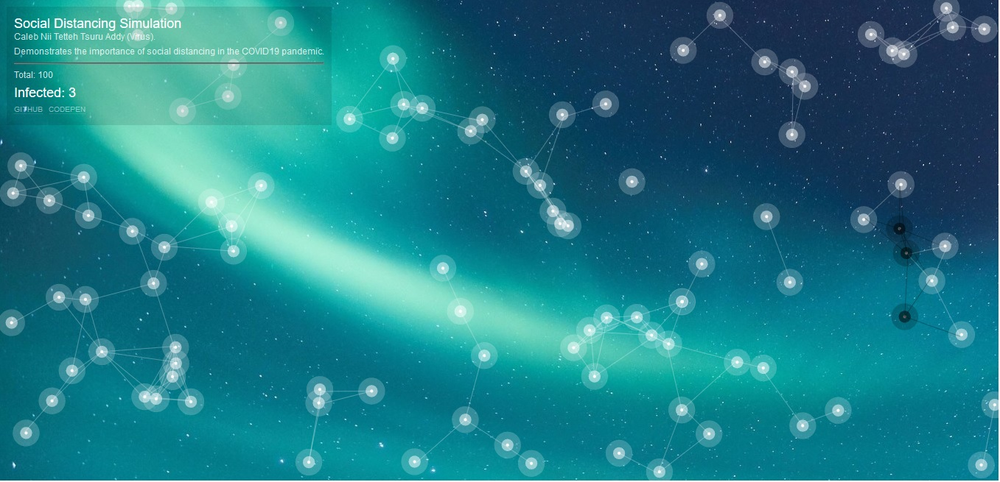
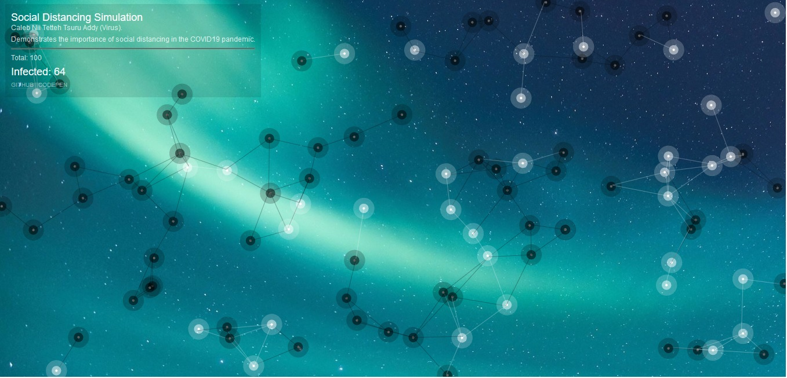

# SocialDistancing
Social distancing is one proven way of preventing the mass spread of the Corona Virus(COVID19). 
This pure javascript application demonstrates the importance of social distancing in the COVID19 pandemic.

Explanation
-----------
The white nodes represent healthy people. The black nodes represent infected/sick people. 
The demonstration starts with one black node. Initially, it doesn't seem like a threat. 

However, within a short time the infection spreads and affects everyone. 

A demo of this project can be viewed at https://codepen.io/redutron/details/NWqENww

Conclusion
----------
It is my hope that this simple illustration helps people understand the need for social distancing
during this COVID19 pandemic and that it helps to save lives.

## Getting Started

These instructions will get you a copy of the project up and running on your local machine for development and testing purposes. 

### Prerequisites

All you'll ever need is a working web browser. That's it.

### Installing
Open the index.html file in your web browser. It's that simple. 

 
## Built With

* Pure javascript.   
## Authors

* **Caleb Nii Tetteh Tsuru Addy(Virus)**   
 
## License

This project is licensed under the GNU General Public License v3.0.
